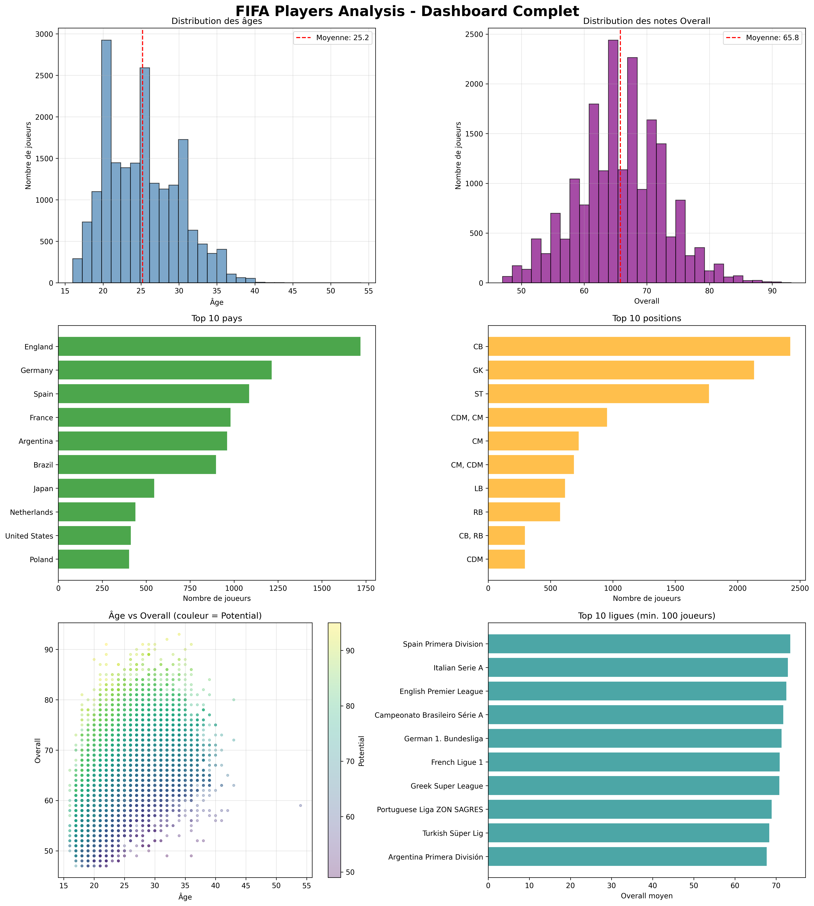

# FIFA 22 Players Analysis

Une analyse complète de plus de 19,000 joueurs de football professionnel pour identifier les tendances de performance, les dynamiques financières et les jeunes talents.



## Objectifs du Projet

1. Analyser les tendances démographiques des joueurs professionnels
2. Identifier les facteurs de performance et l'évolution par âge
3. Comparer les ligues et clubs
4. Analyser les dynamiques salariales
5. Identifier les jeunes talents à fort potentiel

## Résultats Clés

- **19,000+ joueurs** analysés
- **Peak de performance:** 30-33 ans
- **250+ jeunes talents** identifiés (< 23 ans, potential > 80)

## Technologies Utilisées

- **Python 3.10**
- **Pandas** - Manipulation de données
- **Matplotlib & Seaborn** - Visualisations
- **Jupyter Notebook** - Analyse interactive

## Structure du Projet
```
fifa-players-analysis/
├── data/
│   ├── raw/                    # Données brutes
│   └── processed/              # Données nettoyées
├── notebooks/
│   ├── 01_data_exploration.ipynb
│   ├── 02_data_cleaning.ipynb
│   ├── 03_analysis.ipynb
│   └── 04_visualizations.ipynb
├── visualizations/             # Graphiques générés
├── reports/                    # Rapport final
└── README.md
```

## Comment Utiliser

### 1. Cloner le repository
```bash
git clone https://github.com/[ton-username]/fifa-players-analysis.git
cd fifa-players-analysis
```

### 2. Installer les dépendances
```bash
pip install -r requirements.txt
```

### 3. Lancer les notebooks
```bash
jupyter notebook
```

Exécuter les notebooks dans l'ordre:
1. `01_data_exploration.ipynb`
2. `02_data_cleaning.ipynb`
3. `03_analysis.ipynb`
4. `04_visualizations.ipynb`

## Analyses Principales

### 1. Distribution des Âges


### 2. Performance par Âge


### 3. Top Ligues


## Insights Clés

1. **Peak de performance** entre 26-29 ans (overall moyen: 71.8)
2. **Domination des ligues européennes** (Top 5)
3. **250+ jeunes talents** avec potential > 80

## Rapport Détaillé

Le rapport complet est disponible dans [`reports/fifa_analysis_report.md`](reports/fifa_analysis_report.md)

## Développements Futurs

-  Modèle prédictif de performance
-  Analyse de l'impact des blessures
-  Système de recommandation pour le recrutement
-  Dashboard interactif avec Streamlit/Dash
-  API pour requêtes personnalisées

## Auteur

**Jeremie Konan**
- GitHub: (https://github.com/Softwinnerr)
- LinkedIn:(https://linkedin.com/in/jeremie-konan)
- Email: jeremiesofty24@gmail.com


## Remerciements

- Dataset: FIFA 22 Male Players (Kaggle)
- Inspiration: Analyses de données sportives
