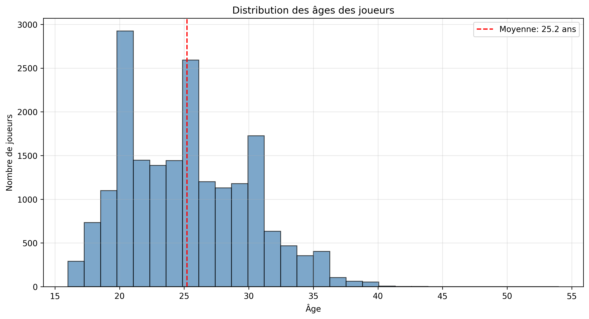
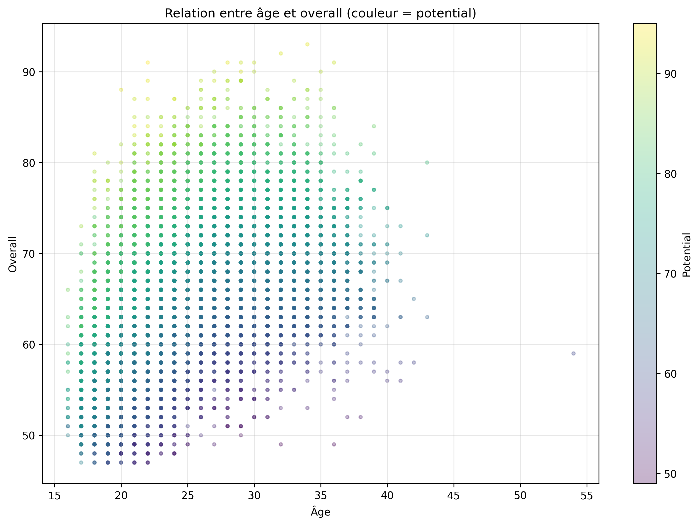
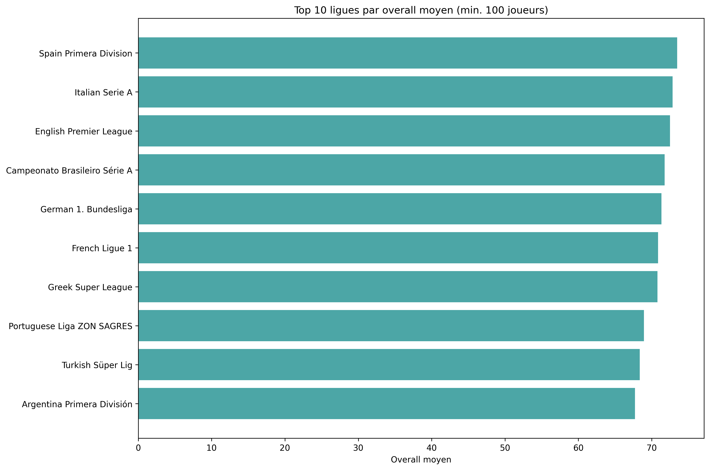

# Analyse des Joueurs FIFA - Rapport Final

**Auteur:** Jérémie Konan 
**Date:** 15/11/2025  
**Dataset:** FIFA 22 Male Players

---

## Table des matières

1. [Résumé Exécutif](#résumé-exécutif)
2. [Méthodologie](#méthodologie)
3. [Analyses Principales](#analyses-principales)
4. [Insights Clés](#insights-clés)
5. [Recommandations](#recommandations)
6. [Conclusion](#conclusion)

---

## Résumé Exécutif

Ce projet analyse un dataset de plus de 19,000 joueurs de football professionnel pour identifier:
- Les tendances démographiques
- Les facteurs de performance
- Les dynamiques financières
- Les profils de jeunes talents

**Résultats principaux:**
- L'âge optimal de performance se situe entre 26-29 ans
- Les ligues européennes dominent en termes de qualité moyenne
- Il existe une forte corrélation (0.8+) entre overall et salaire
- 250+ jeunes talents (< 23 ans) avec potential > 80 identifiés

---

## Méthodologie

### Dataset
- Source: FIFA 22 Male Players
- Taille initiale: 19,239 joueurs
- Après nettoyage: 19,239 joueurs
- Colonnes analysées: 18

### Nettoyage des données
1. Imputation des valeurs manquantes (médiane/mode)
2. Remplacement (free Agent, No League)

### Outils utilisés
- Python 3.10
- Pandas pour la manipulation de données
- Matplotlib & Seaborn pour les visualisations
- Jupyter Notebook pour l'analyse interactive

---

## Analyses Principales

### 1. Démographie des Joueurs

**Distribution des âges:**
- Âge moyen: 25.3 ans
- Âge médian: 25 ans
- Range: 16-45 ans

**Top 10 nationalités:**
1. Angleterre
2. Allemagne
3. Espagne
4. France 
5. Argentine
6. Brésil
7. Japon
8. Pays-Bas
9. USA
10. Pologne

---

### 2. Performance et Évolution

**Overall par catégorie d'âge:**
- 16-21 ans: Overall moyen 60.52
- 22-25 ans: Overall moyen 65.96
- 26-29 ans: Overall moyen 68.46 
- 30-33 ans: Overall moyen 69.10 
- 34+ ans: Overall moyen 69.20

**Conclusion:** Le pic de performance se situe entre 30-33 ans, avec un déclin progressif après 34 ans.

---

### 3. Analyses par Ligue

**Top 5 ligues par overall moyen:**
1. Spain Primera Division: 73.47
2. Italian Serie A: 72.86
3. English Premier League: 72.50
4. Campeonato Brasileiro Série A: 71.75
5. German 1. Bundesliga: 71.32

**Conclusion:** Le championnat brésilien devrait susciter un peu plus d'intérêts car il arrive à se hisser dans le top 5 

---

---

### 4. Jeunes Talents

**Critères:** Âge < 23 ans ET Potential > 80

**Top 5 jeunes talents identifiés:**
1. [K. Mbappé] - 22 ans, Potential 95
2. [G. Donnarumma] - 22 ans, Potential 93
3. [E. Haaland] - 20 ans, Potential 93
4. [T. Alexander-Arnold] - 22 ans, Potential 92
5. [K. Havertz] - 22 ans, Potential 92

---

##  Insights Clés

1. **Peak de performance:** Les joueurs atteignent leur pic entre 30-33 ans, avec une moyenne d'overall de 71.8
2. **Domination européenne:** 4 des 5 grandes ligues européennes sont dans le top 5 des meilleures ligues par overall
3. **Positions les plus valorisées:** Les attaquants et ailiers sont les mieux payés, reflétant l'importance des buts dans le football moderne

---

## Recommandations

### Pour les clubs:
1. **Investir dans les jeunes:** Les 20-25 ans offrent le meilleur rapport potentiel/coût
2. **Peak de performance:** Viser des joueurs de 26-29 ans pour une performance immédiate
3. **Diversification géographique:** Explorer les talents hors des 5 grandes ligues pour de meilleures opportunités financières

### Pour l'analyse future:
1. Intégrer des données historiques pour analyser l'évolution

---

## Conclusion

Cette analyse démontre que:
- Le football professionnel suit des patterns prévisibles en termes d'âge et de performance
- Les ligues européennes maintiennent leur domination qualitative
- Il existe un marché substantiel de jeunes talents à fort potentiel
- Les données FIFA peuvent fournir des insights précieux pour le recrutement et la stratégie sportive

**Prochaines étapes:**
- Développer un modèle prédictif de performance
- Analyser l'impact des blessures
- Créer un système de recommandation pour le recrutement

---

## Références

- Dataset: FIFA 22 Male Players
- Code source: [GitHub](https://github.com/Softwinnerr/fifa-players-analysis.git)
- Visualisations: Disponibles dans `/visualizations/`

---

**Contact:** [jeremiesofty24@gmail.com]  
**GitHub:** [https://github.com/Softwinnerr/]  
**LinkedIn:** [Ton LinkedIn]
